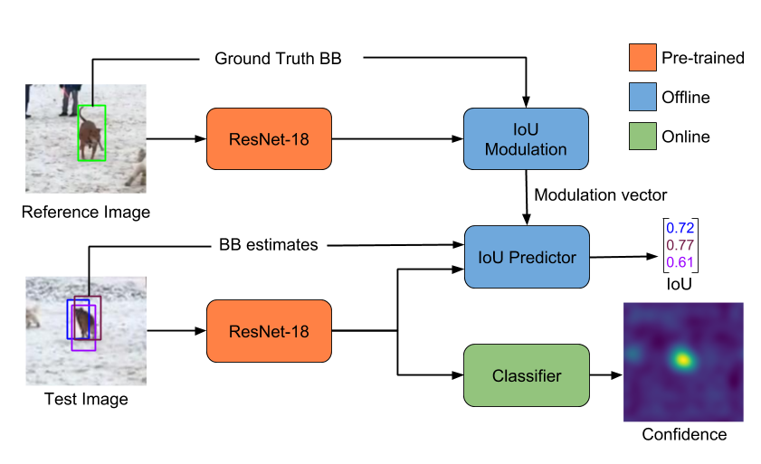

# PyTracking
A general python framework for training and running visual object trackers, based on **PyTorch**.

### News:
* Check out our CVPR 2020 paper [Probabilistic Regression for Visual Tracking](https://arxiv.org/abs/2003.12565). Code coming here soon.
* We are currently integrating support for segmentation (VOS) and multiple objects.    
* Check out our paper [Learning What to Learn for Video Object Segmentation](https://arxiv.org/abs/2003.11540). Code will be released here.  
 
## Highlights

### DiMP and ATOM Trackers

Official implementation of the **DiMP** (ICCV 2019), and 
**ATOM** (CVPR 2019) trackers, including complete **training code** and trained models.

### [Tracking Libraries](pytracking)

Libraries for implementing and evaluating visual trackers. It includes

* All common **tracking datasets**.  
* General building blocks, including **deep networks**, **optimization**, **feature extraction** and utilities for **correlation filter** tracking.  

### [Training Framework: LTR](ltr)
 
**LTR** (Learning Tracking Representations) is a general framework for training your visual tracking networks. It is equipped with

* All common **training datasets** for visual tracking.  
* Functions for data **sampling**, **processing** etc.  
* Network **modules** for visual tracking.
* And much more...


## Trackers
The toolkit contains the implementation of the following trackers.  

### DiMP
**[[Paper]](https://arxiv.org/pdf/1904.07220v1.pdf)  [[Raw results]](https://drive.google.com/drive/folders/15mpUAJmzxemnOC6gmvMTCDJ-0v6hxJ7y)
  [[Models]](https://drive.google.com/open?id=1YEJySjhFokyQ6zgQg6vFAnzEFi1Onq7G)  [[Training Code]](./ltr/README.md#DiMP)  [[Tracker Code]](./pytracking/README.md#DiMP)**
    
Official implementation of the **DiMP** tracker. DiMP is an end-to-end tracking architecture, capable
of fully exploiting both target and background appearance
information for target model prediction. It is based on a target model prediction network, which is derived from a discriminative
learning loss by applying an iterative optimization procedure. The model prediction network employs a steepest descent 
based methodology that computes an optimal step length in each iteration to provide fast convergence. The model predictor also
includes an initializer network that efficiently provides an initial estimate of the model weights.  


 
### ATOM
**[[Paper]](https://arxiv.org/pdf/1811.07628.pdf)  [[Raw results]](https://drive.google.com/drive/folders/1MdJtsgr34iJesAgL7Y_VelP8RvQm_IG_)
  [[Models]](https://drive.google.com/open?id=1EsNSQr25qfXHYLqjZaVZElbGdUg-nyzd)  [[Training Code]](./ltr/README.md#ATOM)  [[Tracker Code]](./pytracking/README.md#ATOM)**  
  
Official implementation of the **ATOM** tracker. ATOM is based on 
(i) a **target estimation** module that is trained offline, and (ii) **target classification** module that is 
trained online. The target estimation module is trained to predict the intersection-over-union (IoU) overlap 
between the target and a bounding box estimate. The target classification module is learned online using dedicated 
optimization techniques to discriminate between the target object and background.
 

 
### ECO
**[[Paper]](https://arxiv.org/pdf/1611.09224.pdf)  [[Models]](https://drive.google.com/open?id=1aWC4waLv_te-BULoy0k-n_zS-ONms21S)  [[Tracker Code]](./pytracking/README.md#ECO)**  

An unofficial implementation of the **ECO** tracker. It is implemented based on an extensive and general library for [complex operations](pytracking/libs/complex.py) and [Fourier tools](pytracking/libs/fourier.py). The implementation differs from the version used in the original paper in a few important aspects. 
1. This implementation uses features from vgg-m layer 1 and resnet18 residual block 3.   
2. As in our later [UPDT tracker](https://arxiv.org/pdf/1804.06833.pdf), seperate filters are trained for shallow and deep features, and extensive data augmentation is employed in the first frame.  
3. The GMM memory module is not implemented, instead the raw projected samples are stored.  

Please refer to the [official implementation of ECO](https://github.com/martin-danelljan/ECO) if you are looking to reproduce the results in the ECO paper or download the raw results.


## [Model Zoo](MODEL_ZOO.md)
The tracker models trained using PyTracking, along with their results on standard tracking 
benchmarks are provided in the [model zoo](MODEL_ZOO.md). 


## Installation

#### Clone the GIT repository.  
```bash
git clone https://github.com/visionml/pytracking.git
```
   
#### Clone the submodules.  
In the repository directory, run the commands:  
```bash
git submodule update --init  
```  
#### Install dependencies
Run the installation script to install all the dependencies. You need to provide the conda install path (e.g. ~/anaconda3) and the name for the created conda environment (here ```pytracking```).  
```bash
bash install.sh conda_install_path pytracking
```  
This script will also download the default networks and set-up the environment.  

**Note:** The install script has been tested on an Ubuntu 18.04 system. In case of issues, check the [detailed installation instructions](INSTALL.md). 

**Windows:** (NOT Recommended!) Check [these installation instructions](INSTALL_win.md). 

#### Let's test it!
Activate the conda environment and run the script pytracking/run_webcam.py to run ATOM using the webcam input.  
```bash
conda activate pytracking
cd pytracking
python run_webcam.py dimp dimp50    
```  


## What's next?

#### [pytracking](pytracking) - for implementing your tracker

#### [ltr](ltr) - for training your tracker

## Main Contributors

* [Martin Danelljan](https://martin-danelljan.github.io/)  
* [Goutam Bhat](https://www.vision.ee.ethz.ch/en/members/detail/407/)
